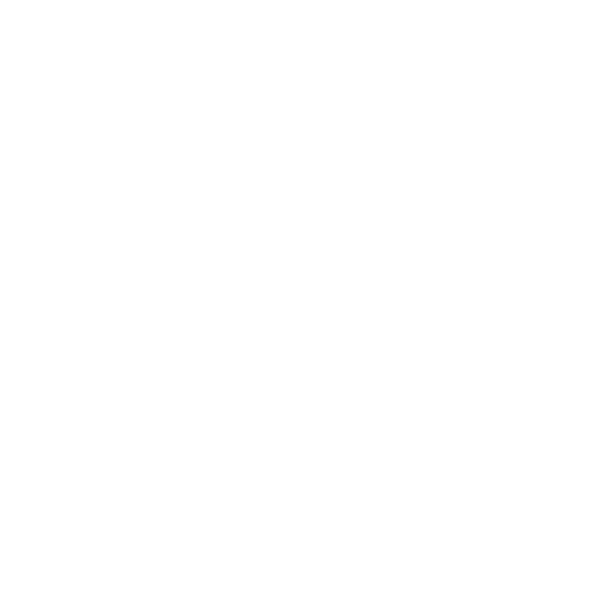
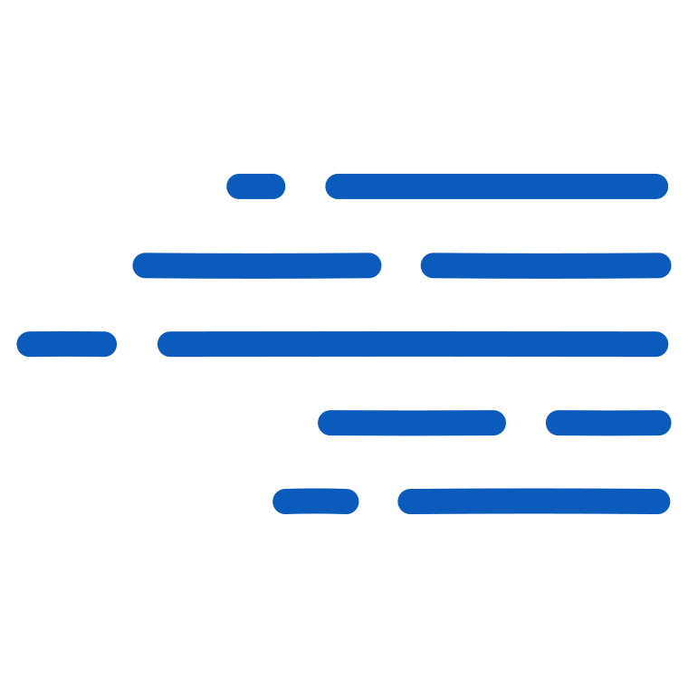

# gexbot Brand Resources

Official brand guidelines, logo assets, color specifications, and typography standards for **gexbot**, the
flagship product of Not Financial Advice, LLC (NFA).

---

## 1. Official Names & Identity

- **Product Name**: `gexbot` (written in all lowercase letters within branding lockups).
- **Company**: Not Financial Advice, LLC (NFA). There is no official logo for NFA itself - the gexbot logo is
  the only official logo.
- **Domain**: [gexbot.com](https://gexbot.com)
- **Documentation**: [docs.gexbot.com](https://gexbot.com) (see `gexbot-docs` repo)

---

## 2. Brand Asset Index

All vector assets are available in [`svg/`](svg/). Raster exports are available in [`png/`](png/), [`webp/`](webp/),
and [`jpg/`](jpg/). Every raster filename spells out its exact pixel dimensions as `WIDTHxHEIGHT`, e.g.
`gexbot-icon-dark-180x180.png` is 180x180px - no separate lookup needed to know what a file contains.

Each layout variant comes in a **dark** and **light** theme. "Dark" means *for use on dark backgrounds* (drawn in
white), and "light" means *for use on light backgrounds* (drawn in black) - matching how the color is named after
the surface it targets, not the color of the mark itself.

### A. Icon / Symbol Only

| Preview | Variant | File (SVG) | Raster Exports | Usage |
| :---: | :--- | :--- | :--- | :--- |
|  | **Dark Mode** | [`svg/icon/gexbot-icon-dark.svg`](svg/icon/gexbot-icon-dark.svg) | 100px, 180px | Default symbol on dark backgrounds. |
|  | **Light Mode** | [`svg/icon/gexbot-icon-light.svg`](svg/icon/gexbot-icon-light.svg) | 100px, 180px | Light backgrounds and printed materials. |
|  | **Brand Blue** | [`svg/icon/gexbot-icon-blue.svg`](svg/icon/gexbot-icon-blue.svg) | 100px, 180px | Accents, badges, and marketing highlights (`#0b5bbc`). |
|  | **Adaptive** | [`svg/icon/gexbot-icon-adaptive.svg`](svg/icon/gexbot-icon-adaptive.svg) | - | Automatic dark/light switching via `prefers-color-scheme` CSS media query. |

### B. Inline / Horizontal Lockups

| Variant | File (SVG) | Raster Exports | Recommended Background |
| :--- | :--- | :--- | :--- |
| **Dark Mode** | [`svg/inline/gexbot-inline-dark.svg`](svg/inline/gexbot-inline-dark.svg) | 100x34, 180x60, 540x180 | Dark UI surfaces. |
| **Light Mode** | [`svg/inline/gexbot-inline-light.svg`](svg/inline/gexbot-inline-light.svg) | 100x34, 180x60, 540x180 | White or light gray backgrounds. |

### C. Stacked Lockups

| Variant | File (SVG) | Raster Exports | Recommended Background |
| :--- | :--- | :--- | :--- |
| **Dark Mode Stacked** | [`svg/stacked/gexbot-stacked-dark.svg`](svg/stacked/gexbot-stacked-dark.svg) | 100x50, 180x90, 360x180 | Square avatars, splash screens, app tiles on dark surfaces. |
| **Light Mode Stacked** | [`svg/stacked/gexbot-stacked-light.svg`](svg/stacked/gexbot-stacked-light.svg) | 100x50, 180x90, 360x180 | Light theme avatars and merchandise. |

### D. Wordmark Only

The "gexbot" text lockup with no icon mark, isolated from the inline artwork.

| Variant | File (SVG) | Raster Exports |
| :--- | :--- | :--- |
| **Dark Mode** | [`svg/wordmark/gexbot-wordmark-dark.svg`](svg/wordmark/gexbot-wordmark-dark.svg) | 100x31, 180x56, 582x180 |
| **Light Mode** | [`svg/wordmark/gexbot-wordmark-light.svg`](svg/wordmark/gexbot-wordmark-light.svg) | 100x31, 180x56, 582x180 |
| **Brand Blue** | [`svg/wordmark/gexbot-wordmark-blue.svg`](svg/wordmark/gexbot-wordmark-blue.svg) (`#0b5bbc`) | 100x31, 180x56, 582x180 |

### E. App & Browser Favicons

Favicon assets are located in [`png/favicon/`](png/favicon/) and [`svg/favicon/`](svg/favicon/), generated from the
light-theme icon:
- `favicon-16x16.png` & `favicon-32x32.png`: Standard desktop browser tabs. Note: at true 16px the icon's fine
  parallel-bar strokes get muddy - this is a legibility limitation of the mark itself at very small sizes, not
  an export artifact.
- `apple-touch-icon.png` (180x180): iOS Safari home screen bookmark.
- `favicon-192x192.png` & `favicon-512x512.png`: Android Chrome and PWA manifests.
- `favicon.ico`: legacy multi-resolution (16/32px) icon.
- `favicon.svg`: adaptive icon, switches color automatically with the browser's OS-level theme.

### F. Marketing & Supporting Assets

Not part of the core logo system, but shipped in this repo:
- [`hero/`](hero/) - hero/marketing images (e.g. `gexbot-edge`, `gexbot-state`).
- [`icons/`](icons/) - misc docs iconography.
- [`social/`](social/) - third-party logos (Discord, X) for attribution use, not gexbot's own branding.
- [`color/color.jpeg`](color/color.jpeg) - swatch reference image for [colors.md](colors.md).

---

## 3. Brand Colors

See [`colors.md`](colors.md) for full color specifications.

| Color | Hex | Usage |
| :--- | :--- | :--- |
| **Brand Blue** | `#0b5bbc` | Primary accent - active nav/UI highlights, `blue` logo variant. |
| **Brand Blue (Light Tint)** | `#64b5f6` | Same accent, adjusted for contrast on dark surfaces. |
| **Black** | `#000000` | Primary logo color, light-theme lockups. |
| **White** | `#ffffff` | Primary logo color, dark-theme lockups. |

`colors.md` also documents the separate chart/gamma-exposure accent palette (GEX OI, GEX Vol, gamma levels, etc.) -
those are for data visualization only and are not brand/logo colors.

---

## 4. Typography

See [`typography.md`](typography.md) for complete typography guidance.

- The `gexbot` wordmark uses **Agrandir** (Regular).
- Always write `gexbot` in lowercase within branding lockups. Never capitalize as `Gexbot` or `GEXBOT`.

---

## 5. Usage Rules & Best Practices

1. **Maintain Clear Space**: Keep clear space around the logo equal to at least half the width of the icon mark.
2. **Do Not Distort**: Never stretch, squeeze, rotate, or alter the proportions of the icon mark or wordmark.
3. **Do Not Re-color Unapproved Combinations**: Only use black, white, or brand blue (`#0b5bbc`) on the logo. Do not
   apply the chart/gamma-exposure accent colors (green, red, purple, etc. from `colors.md`) to the logo itself.
4. **Match the Background**: Use the dark-mode lockup on dark backgrounds and the light-mode lockup on light
   backgrounds (or the `adaptive` icon where CSS media queries are supported).
5. **Use Vector Sources for New Sizes**: Always re-export from `svg/` for new sizes rather than upscaling an
   existing raster file.

## Social Media
#### Twitter/X
The primary social media account for the _gexbot_ product is the Twitter/X account [@thegexbot](https://twitter.com/thegexbot). The account is used for product updates and announcements and intraday market updates.
Additional Twitter/X accounts include:
- [@gexbot15](https://twitter.com/gexbot15) includes intraday market updates.
- [@gexbot_hist](https://twitter.com/gexbot_hist) includes market changes on a day-to-day timeframe.

#### Discord
The Discord server for the _gexbot_ product is [gexbot](https://discord.gg/gexbot). The server is used for product updates and announcements, intraday market updates, and community discussions.
