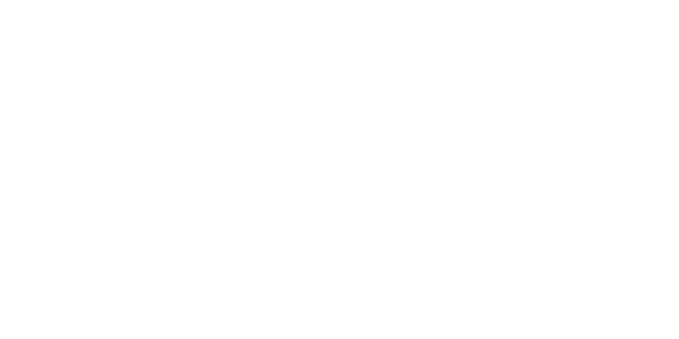
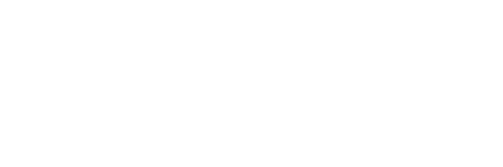

# Not Financial Advice, LLC Brand Resources

Brand guidelines and resources for Not Financial Advice, LLC and its products.

## Official Names

#### Not Financial Advice, LLC
Official company name is _Not Financial Advice, LLC_. The company is often referred to as _NFA_.

#### gexbot
The flagship product is _gexbot_. The name is written in all lowercase letters. 

The gexbot product is a trading bot that uses the gamma exposure of options to visualize the market.

## Logos

There is no official logo for _Not Financial Advice, LLC_. The logo for the _gexbot_ product is the only official logo.

Logo files are available in the `img/logo/gexbot` directory of this repository, split into one subfolder per format:
`svg` (source of truth), `png`, `webp`, and `jpg`.

There are three layout variants, each with a dark and light theme. The dark version is intended for use on light
backgrounds, and the light version is intended for use on dark backgrounds.

- **icon** - the graphic mark alone, no wordmark (square)
- **inline** - mark and "gexbot" wordmark side by side (wide)
- **stacked** - mark and "gexbot" wordmark stacked

Filenames follow the pattern `gexbot_logo_<variant>_<theme>[_<width>x<height>].<ext>`. SVGs are unsized (vector);
raster exports (`png`/`webp`/`jpg`) bake the exact pixel dimensions into the filename, e.g.
`gexbot_logo_inline_dark_540x180.png` is 540×180px. No guessing which "180" a size suffix refers to - the full
`WIDTHxHEIGHT` is always spelled out.

<div style="display: flex; justify-content: space-around; flex-direction: column; align-items: center;">
<div style="margin: 1em;">


</div>
<div style="margin: 1em;">


</div>
<div style="margin: 1em;">


</div>
</div>

## Domains
The primary domain for the _gexbot_ product is [gexbot.com](https://gexbot.com). The domain is used for the product website and the product API.

## Social Media
#### Twitter/X
The primary social media account for the _gexbot_ product is the Twitter/X account [@thegexbot](https://twitter.com/thegexbot). The account is used for product updates and announcements and intraday market updates.
Additional Twitter/X accounts include:
- [@gexbot15](https://twitter.com/gexbot15) includes intraday market updates.
- [@gexbot_hist](https://twitter.com/gexbot_hist) includes market changes on a day-to-day timeframe.

#### Discord
The Discord server for the _gexbot_ product is [gexbot](https://discord.gg/gexbot). The server is used for product updates and announcements, intraday market updates, and community discussions.

## Colors
The primary colors for the _gexbot_ product are black and white. The black color is used for the dark version of the logo, and the white color is used for the light version of the logo.
See [color.md](color.md) for additional colors.

## Typography
The primary font for the _gexbot_ product is _Agrandir_. The font weight used are _Regular_. The font is available for download in the `font` directory of this repository.

## Folder Structure
Everything under `img/` is organized by **asset type**, not by brand (there is currently only one brand, gexbot; the
other NFA product has its own `skewbot-brand-resources` repo).

```
img/
├── logo/gexbot/   Official logo, split into svg (source of truth) / png / webp / jpg
├── color/         Swatch reference image for color.md
├── font/          Agrandir-Regular.otf
├── hero/          Marketing/hero images
├── icons/         Misc docs iconography
└── social/        Third-party logos (Discord, X) for attribution use
```

Within `img/logo/gexbot/`, each format folder holds the same three layout variants (`icon`/`inline`/`stacked`) in both
themes (`dark`/`light`), with raster sizes spelled out as `WIDTHxHEIGHT` in the filename - see [Logos](#logos) above
for naming details. There is no legacy or draft artwork kept in this repo; only the current, in-use logo set is
checked in.
