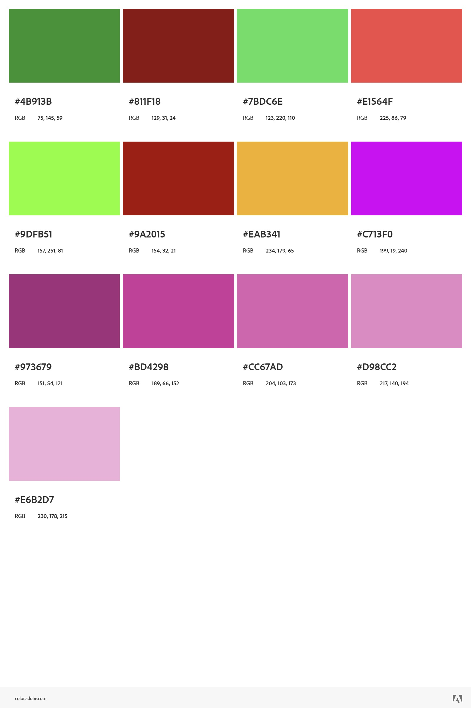

# Color

## Brand Color
The official _gexbot_ brand accent color is **brand blue**, sourced from the canonical `BRAND_BLUE` constant in
`react-frontend/src/styles/themes.ts` and the `--color-fd-primary` token in `gexbot-docs`. It is used for active/
highlighted UI elements (e.g. the top nav bar) across both the app's light and dark themes.

▉ BRAND BLUE = "#0b5bbc"
▉ BRAND BLUE (LIGHT TINT, for dark surfaces) = "#64b5f6"

The primary logo colors remain black and white (see [README.md](README.md#logos)) - brand blue is an accent only,
for UI and the `blue` logo variant, not a replacement for the black/white lockups.

## Chart / Gamma Exposure Colors
Additional colors for the _gexbot_ product are available for use in marketing materials. These colors are intended to be used as accents and should not be the primary color in any design.

▉ POSITIVE GEX OI COLOR = "#4b913b"
▉ NEGATIVE GEX OI COLOR = "#811f18"

▉ POSITIVE GEX VOL COLOR = "#7bdc6e"
▉ NEGATIVE GEX VOL COLOR = "#e1564f"

▉ MAJOR POS GAMMA COLOR = "#9dfb51"
▉ MAJOR NEG GAMMA COLOR = "#9a2015"
▉ ZERO GAMMA COLOR = "#eab341"

▉ NET CONVEXITY COLOR = "#c713f0"

▉ PRIOR 30 COLOR = "#973679"
▉ PRIOR 15 COLOR = "#bd4298"
▉ PRIOR 10 COLOR = "#cc67ad"
▉ PRIOR 5 COLOR = "#d98cc2"
▉ PRIOR 1 COLOR = "#e6b2d7"

